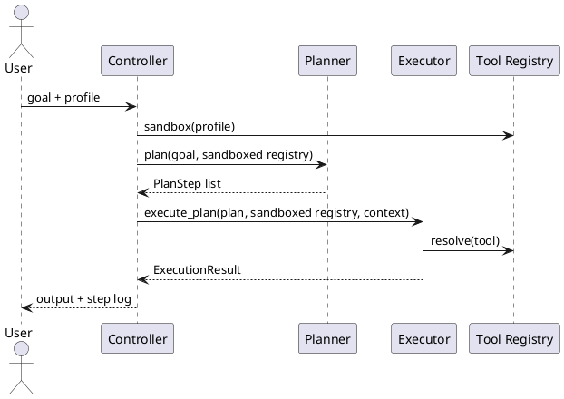

# Agents & Orchestration Guide

This document is the entrypoint for Codex/LLM contributors. It outlines guardrails, the controller → planner → executor pipeline, and where to find deeper documentation.

## Guardrails (apply everywhere)
- Keep subagents isolated: no shared mutable state or tool leakage between profiles.
- Harden secrets: API keys must be non-empty (see Langflow prod guard) and never logged.
- Prefer deterministic, minimal changes with clear tests and docs.
- Resolve registry fragments relative to their profile file and fail fast on conflicts.

## Architecture overview
- **Controller** (`src/cuga/agents/controller.py`): owns orchestration, validates inputs, and delegates to planner/executor with a sandboxed registry per profile.
- **Planner** (`src/cuga/agents/planner.py`): converts a goal into ordered `PlanStep` objects based on available tools.
- **Executor** (`src/cuga/agents/executor.py`): runs plan steps with profile-scoped tools and returns structured results.
- **Registry** (`src/cuga/agents/registry.py`): stores tool metadata per profile, supports isolation via `sandbox`, and enforces conflict-free merges.

### Message flow (PlantUML)

## Profiles and registry generation
- Profiles live under `configurations/profiles`. The merge script now returns the profile path so fragment paths are resolved relative to the file.
- Templated Langflow prod projects come from `[profiles.<name>.langflow_prod_projects]`; see `docs/registry_merge.md` for conflict semantics and deprecation notices for legacy fragments.
- Use `make profile-demo_power` to emit `build/mcp_servers.demo_power.yaml`. Run `eval $(make env-dev)` or `set -a; source .env.mcp; set +a` to export `MCP_SERVERS_FILE` for tooling.

## Documentation map
- **README.md** – project overview and quickstart, including updated environment setup.
- **docs/registry_merge.md** – conflict detection, templating, and troubleshooting for registry assembly.
- **docs/mcp_integration.md** – details on MCP usage in the wider system.
- **docs/Security.md** – security expectations and key handling.

## Troubleshooting
- Duplicate `mcpServers` or service names: remove the conflicting fragment or rename the service (errors list both files).
- YAML parse errors: fix the file shown in the error (line numbers included when the parser provides them).
- Wrong profile paths: ensure fragments are relative to the profile file location.
