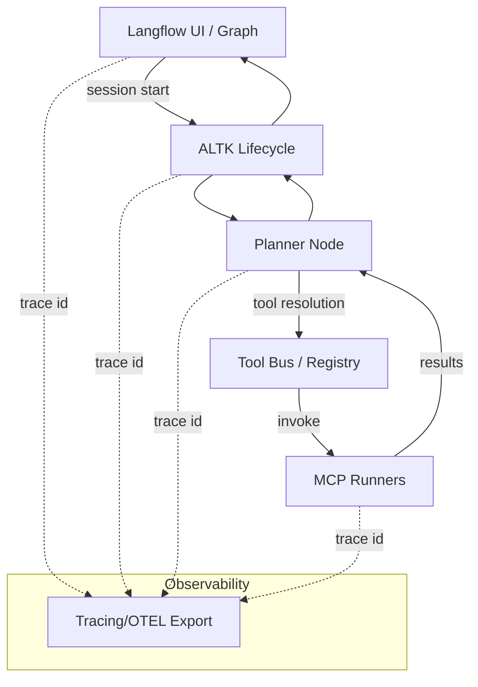

# Architecture Overview

## Controller / Planner / Tool Bus Topology

- **Planning**: Langflow graph triggers ALTK lifecycle hooks; planner selects tools based on registry metadata and policy.
- **Dispatch**: Tool Bus mediates deterministic registry merges, capability lookup, and sandbox selection before issuing MCP calls.
- **Execution**: MCP runners (E2B/Docker sandboxes, filesystem, web/VCS, vector DB, etc.) execute with profile-scoped mounts and allowlisted network.
- **Tracing**: Correlation IDs propagate `Langflow → ALTK → Planner → Tool Bus → MCP runner` with ordered spans and redaction before export.

## Data Flow (Tiered)
1. **Request** enters Langflow node, creating a correlation ID and lifecycle session.
2. **Planner** builds a step list, resolves tools from the profile registry, and attaches sandbox hints.
3. **Tool Bus** deep-copies registry fragments, validates scopes, and dispatches to the selected MCP runner.
4. **Sandboxed execution** returns typed results; outputs land in profile namespaces (filesystem, memory, vector DB) as configured.
5. **Observability** exports spans/metrics with PII redaction; failures trigger fallbacks (cached responses, retries, or safe halts).

## Profiles and Isolation
- Profile IDs gate registry selection, sandbox mounts, and cache keys; no cross-profile writes by default.
- Sandbox defaults: bounded CPU/mem/time, read-only rootfs, outbound network allowlists, and audit logs for every MCP call.
- Optional Tier 2 MCPs remain feature-flagged; enable only after Tier 1 hardening and red-team checks.
